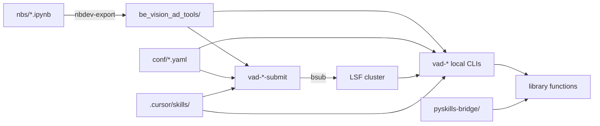

# CLI & Agent Skills Changelog

**Branch:** `feature/hydra-e2e-cli`  
**PR:** [#5 — Hydra CLIs for end-to-end tutorial + nbdev3 pyproject](https://github.com/HasanGoni/vision_ad_tool/pull/5)  
**Base:** `main`  
**Generated:** 2026-08-01

This document explains **what changed**, **why**, and **how to use** the Hydra CLIs, HPC submit wrappers, and pyskills-aligned agent skills added on this branch.

---

## Executive summary

| Layer | What you get |
|-------|--------------|
| **Local Hydra CLIs** | 7 `vad-*` commands for train/infer/organize pipelines — config-driven, overridable on the CLI |
| **HPC submit CLIs** | 7 `vad-*-submit` commands that wrap `bsub` and run the matching local CLI on the office LSF cluster |
| **Cursor skills** | 15 skills (8 workflow + 7 HPC submit) under `.cursor/skills/` with shell scripts |
| **pyskills twins** | Python-callable mirrors in `pyskills-bridge/` for Solveit / clikernel agents |
| **nbdev3 migration** | Notebooks export to `be_vision_ad_tools/`; configs packaged under the library |

---

## Commit history (`main..feature/hydra-e2e-cli`)

| Commit | Summary |
|--------|---------|
| `9ac1445` | Initial Hydra CLIs (`vad-train` … `vad-full`), nbdev3 `pyproject.toml` migration |
| `fa855b0` | Full pyskills-aligned Cursor skills + pyskills-bridge modules |
| `93aa2ac` | nbdev-native export path; `vad-hyperparam-search` CLI + skill |
| `828f64e` | Fix nbdev v3 CLI names (`nbdev-export` not underscore); lazy imports; import paths |
| `6d8d0a9` | Export `create_posters_for_score_folders` from notebook 14 (poster workflow fix) |
| `839358d` | Align agent skill docs with pyskills audit (DISCOVER/CURATE/DEMONSTRATE/…) |
| `7cfe5da` | HPC `vad-*-submit` CLIs, submit skills, pyskills twins |
| `f11fa83` | Smoke-test `vad-train-submit` in `verify-ad-pipeline` |

**Diff size:** ~101 files changed, +7,027 / −4,113 lines.

---

## 1. Hydra local CLIs (nbdev way)

### Why

Before this branch, tutorial workflows lived in ad-hoc scripts under `tutorials/end2end_tutorial/`. The goal was to make every pipeline **reproducible**, **config-driven**, and **agent-friendly**: one YAML default per workflow, Hydra overrides on the command line, and nbdev as the single source of truth.

### Source notebooks → exported modules

| Notebook | Exported module | CLIs registered |
|----------|-----------------|-----------------|
| `nbs/18_tutorials.end2end_hydra_cli.ipynb` | `be_vision_ad_tools/tutorials/end2end_cli.py` | `vad-train`, `vad-infer`, `vad-organize`, `vad-infer-organize`, `vad-train-infer`, `vad-full` |
| `nbs/19_training.hyperparameter_hydra_cli.ipynb` | `be_vision_ad_tools/training/hyperparameter_hydra_cli.py` | `vad-hyperparam-search` |

Entry points are declared in `pyproject.toml` under `[project.scripts]`.

### Config location

All Hydra YAML defaults live in:

```
be_vision_ad_tools/tutorials/conf/
├── train.yaml
├── infer.yaml
├── organize.yaml
├── infer_organize.yaml
├── train_infer.yaml
├── full.yaml
├── hyperparam_search.yaml
└── hpc/
    └── submit_defaults.yaml   # shared HPC section (used by submit CLIs)
```

Configs are **packaged** with the library via:

```toml
[tool.setuptools.package-data]
"be_vision_ad_tools.tutorials" = ["conf/*.yaml", "conf/hpc/*.yaml"]
```

### Master mapping: CLI → module → notebook → skill → config

| CLI | Module function | Notebook | Cursor skill | Default config |
|-----|-----------------|----------|--------------|----------------|
| `vad-train` | `train_cli` | `18_tutorials.end2end_hydra_cli` | `train-anomaly-model` | `conf/train.yaml` |
| `vad-infer` | `infer_cli` | `18_tutorials.end2end_hydra_cli` | `run-ad-inference` | `conf/infer.yaml` |
| `vad-organize` | `organize_cli` | `18_tutorials.end2end_hydra_cli` | `organize-anomaly-scores` | `conf/organize.yaml` |
| `vad-infer-organize` | `infer_organize_cli` | `18_tutorials.end2end_hydra_cli` | `infer-organize-ad` | `conf/infer_organize.yaml` |
| `vad-train-infer` | `train_infer_cli` | `18_tutorials.end2end_hydra_cli` | `train-infer-ad` | `conf/train_infer.yaml` |
| `vad-full` | `full_cli` | `18_tutorials.end2end_hydra_cli` | `full-ad-pipeline` | `conf/full.yaml` |
| `vad-hyperparam-search` | `hyperparam_search_cli` | `19_training.hyperparameter_hydra_cli` | `hyperparameter-search-ad` | `conf/hyperparam_search.yaml` |

### How to use (local)

```bash
# One-time setup
uv sync

# Train with defaults + overrides
vad-train data_root=/path/to/data model_name=patchcore class_name=my_product

# Full pipeline: train then infer-organize on test set
vad-full train.data_root=/data/train infer_organize.test_images=/data/test

# Hyperparameter grid search + comparison poster
vad-hyperparam-search data_root=/data/train test_images=/data/test
```

Any field in the YAML can be overridden with Hydra dot notation (`train.max_epochs=50`, nested keys for composite configs).

### Legacy shims

` tutorials/end2end_tutorial/` remains as a **backward-compatibility shim** — thin re-exports pointing at the nbdev-exported modules. Old import paths like `tutorials.end2end_tutorial.workflow` still work; new code should use `be_vision_ad_tools.tutorials.end2end_cli`.

See `tutorials/end2end_tutorial/README.md` for the compatibility table.

### nbdev v3 workflow

| Task | Command (v3 — hyphenated) |
|------|---------------------------|
| Export notebooks → Python | `uv run nbdev-export` |
| Run notebook tests | `uv run nbdev-test` |
| Prepare release | `uv run nbdev-prepare` |

**Do not** use the old underscore forms (`nbdev_export`). Settings live in `pyproject.toml` `[tool.nbdev]` (`update_pyproject = true`).

After editing `nbs/18_*`, `nbs/19_*`, or `nbs/20_*`, always re-export before testing entry points.

---

## 2. HPC submit CLIs

### Why

Heavy training and inference run on the office **LSF cluster** via `bsub`. Rather than hand-crafting batch scripts per workflow, each local `vad-*` CLI gets a **submit twin** that:

1. Composes the same Hydra config (workflow + HPC defaults)
2. Converts non-HPC fields to Hydra override strings
3. Builds a remote shell command (`cd <repo> && uv run vad-<workflow> …`)
4. Submits via `bsub` with GPU/queue/memory settings from config

### Source

| Notebook | Exported module | CLIs |
|----------|-----------------|------|
| `nbs/20_tutorials.hpc_submit_cli.ipynb` | `be_vision_ad_tools/tutorials/hpc_submit_cli.py` | All 7 `vad-*-submit` commands |

### Submit mapping table

| Submit CLI | Local CLI | Config overlay | Cursor skill |
|------------|-----------|----------------|--------------|
| `vad-train-submit` | `vad-train` | `conf/train_submit.yaml` | `submit-train-ad-hpc` |
| `vad-infer-submit` | `vad-infer` | `conf/infer_submit.yaml` | `submit-infer-ad-hpc` |
| `vad-organize-submit` | `vad-organize` | `conf/organize_submit.yaml` | `submit-organize-ad-hpc` |
| `vad-infer-organize-submit` | `vad-infer-organize` | `conf/infer_organize_submit.yaml` | `submit-infer-organize-ad-hpc` |
| `vad-train-infer-submit` | `vad-train-infer` | `conf/train_infer_submit.yaml` | `submit-train-infer-ad-hpc` |
| `vad-full-submit` | `vad-full` | `conf/full_submit.yaml` | `submit-full-ad-hpc` |
| `vad-hyperparam-search-submit` | `vad-hyperparam-search` | `conf/hyperparam_search_submit.yaml` | `submit-hyperparam-search-ad-hpc` |

Each `*_submit.yaml` uses Hydra defaults composition:

```yaml
defaults:
  - train          # (or infer, full, etc.)
  - hpc/submit_defaults
  - _self_

hpc:
  job_name: vad-train
  local_cli: vad-train
```

### HPC config (`conf/hpc/submit_defaults.yaml`)

| Key | Purpose | Default |
|-----|---------|---------|
| `queue` | LSF queue | `batch` (or `gpu` when `use_gpu: true`) |
| `cores` | `-n` | `4` |
| `memory_mb` | Appended to `-R` resource string | `8000` |
| `walltime_minutes` | `-W` | `240` |
| `use_gpu` | Switch to GPU bsub template | `false` |
| `dry_run` | Print bsub argv without submitting | `false` |
| `log_dir` | stdout/stderr log directory | `./hpc_logs` |
| `project_root` | Remote `cd` target | auto-detected from `pyproject.toml` |
| `run_prefix` | Prefix before CLI | `uv run` (if `uv` on PATH) |

`build_bsub_args()` reuses `HPC_Job.BSUB_ARGS_DEFAULT` / `BSUB_ARGS_DEFAULT_GPU` from `be_vision_ad_tools.inference.multinode_from_aiop_tool`.

### How to use (HPC)

```bash
# Preview submission on a machine without bsub (laptop)
vad-train-submit data_root=/data/my_product hpc.dry_run=true

# Submit with GPU queue override
vad-train-submit data_root=/data/my_product hpc.use_gpu=true hpc.queue=gpu hpc.walltime_minutes=480

# Submit full pipeline
vad-full-submit train.data_root=/data/train infer_organize.test_images=/data/test
```

On success, the CLI prints a dict with `lsf_job_id`, log paths, `remote_command`, and `bsub_argv`. Logs land in `hpc_logs/` (or `hpc.log_dir`).

### dry_run mode

Set `hpc.dry_run=true` when:

- Developing on a machine without LSF (`bsub` not on PATH)
- Auditing the exact remote command before submitting
- CI smoke tests (see `verify-ad-pipeline`)

---

## 3. Agent skills (pyskills steal pattern)

### Why

Cursor and Copilot agents need **curated, repeatable workflows** — not open-ended "run some Python." The [pyskills](https://github.com/AnswerDotAI/pyskills) architecture (progressive disclosure, public API, demonstrations) was adapted for markdown skills. See `docs/agent-skills-from-pyskills.md`.

### The DISCOVER / CURATE / DEMONSTRATE / EXECUTE / BOUND pattern

| Letter | pyskills | Cursor skill |
|--------|----------|--------------|
| **D**iscover | First docstring paragraph → `list_pyskills()` | YAML `description:` in `SKILL.md` frontmatter |
| **C**urate | `__all__` | Public API table + `scripts/` only |
| **D**emonstrate | Completed example in docstring | "What done looks like" section |
| **E**xecute | Python functions | `bash .cursor/skills/<name>/scripts/*.sh` |
| **B**ound | `allow(func)` whitelist | "Do not invent other commands" |

### Skills inventory (15 total)

#### Workflow skills (8)

| Skill directory | Trigger | Script |
|-----------------|---------|--------|
| `.cursor/skills/verify-ad-pipeline/` | After editing `be_vision_ad_tools/` or `nbs/` | `verify_sync.sh`, `verify_imports.sh`, `verify_nbdev.sh` |
| `.cursor/skills/train-anomaly-model/` | Train/fit AD model | `train_model.sh` |
| `.cursor/skills/run-ad-inference/` | Batch-score images | `run_inference.sh` |
| `.cursor/skills/organize-anomaly-scores/` | Triage by score | `organize_scores.sh` |
| `.cursor/skills/infer-organize-ad/` | Infer + buckets + posters | `infer_organize.sh` |
| `.cursor/skills/train-infer-ad/` | Train + validation posters | `train_infer.sh` |
| `.cursor/skills/full-ad-pipeline/` | End-to-end train + test triage | `full_pipeline.sh` |
| `.cursor/skills/hyperparameter-search-ad/` | Model comparison / grid search | `hyperparam_search.sh` |

#### HPC submit skills (7)

| Skill directory | Submit CLI | Script |
|-----------------|------------|--------|
| `.cursor/skills/submit-train-ad-hpc/` | `vad-train-submit` | `submit_train.sh` |
| `.cursor/skills/submit-infer-ad-hpc/` | `vad-infer-submit` | `submit_infer.sh` |
| `.cursor/skills/submit-organize-ad-hpc/` | `vad-organize-submit` | `submit_organize.sh` |
| `.cursor/skills/submit-infer-organize-ad-hpc/` | `vad-infer-organize-submit` | `submit_infer_organize.sh` |
| `.cursor/skills/submit-train-infer-ad-hpc/` | `vad-train-infer-submit` | `submit_train_infer.sh` |
| `.cursor/skills/submit-full-ad-hpc/` | `vad-full-submit` | `submit_full.sh` |
| `.cursor/skills/submit-hyperparam-search-ad-hpc/` | `vad-hyperparam-search-submit` | `submit_hyperparam_search.sh` |

### pyskills-bridge Python twins

For Python-kernel agents (Solveit, clikernel), each workflow has a twin module:

```
pyskills-bridge/
├── train_ad/skill.py              → train()
├── infer_ad/skill.py              → infer()
├── organize_ad/skill.py           → organize()
├── infer_organize_ad/skill.py     → infer_organize()
├── train_infer_ad/skill.py        → train_infer()
├── full_ad/skill.py               → full_pipeline()
├── hyperparameter_search_ad/skill.py → hyperparam_search()
├── submit_train_ad_hpc/skill.py   → submit_train()
├── submit_infer_ad_hpc/skill.py   → submit_infer()
├── … (7 submit modules total)
├── verify_ad/skill.py             → verify_all()
└── REFERENCE.md                   → full cross-reference table
```

Each module follows the pyskills contract:

- Discovery paragraph in module docstring
- `__all__` listing public functions
- `allow(...)` on exported callables
- Thin wrappers around the same library functions the Hydra CLIs call

**Install & list skills:**

```bash
cd pyskills-bridge && uv sync
uv run python -c "from pyskills import list_pyskills; print([k for k in list_pyskills() if k.endswith('.skill')])"
```

**Python-kernel example:**

```python
from pyskills import doc
import submit_train_ad_hpc.skill as st

print(doc(st))
st.submit_train('/data/my_product', dry_run=True)
```

### Adding a new workflow (convention from `AGENTS.md`)

1. Local CLI in `nbs/*_hydra_cli.ipynb` (or extend `end2end_cli`)
2. Submit CLI in `nbs/20_tutorials.hpc_submit_cli.ipynb` + `*_submit.yaml`
3. Register both in `pyproject.toml` `[project.scripts]`
4. Cursor skill: `.cursor/skills/<name>/SKILL.md` + `scripts/*.sh`
5. pyskills twin: `pyskills-bridge/<module>/skill.py`
6. Update `pyskills-bridge/REFERENCE.md`, `docs/agent-skills-from-pyskills.md`, `.github/copilot-instructions.md`

---

## 4. Other notable fixes

### `create_posters_for_score_folders` export (notebook 14)

**Problem:** `predict_and_organize_by_score` and `vad-infer-organize` poster workflows failed after nbdev export because `create_posters_for_score_folders` was missing from the exported module.

**Fix:** Commit `6d8d0a9` re-exported `nbs/14_inference.anomaly_score_organizer.ipynb` and `nbs/15_inference.unified_with_threshold_posters.ipynb` with the function properly exported.

### nbdev3 `pyproject.toml` migration

| Before | After |
|--------|-------|
| `settings.ini` as primary nbdev config | `[tool.nbdev]` in `pyproject.toml` |
| `setup.py` for packaging | `pyproject.toml` + setuptools |
| nbdev v2 underscore CLIs | nbdev v3 hyphenated CLIs (`nbdev-export`) |
| Configs under `tutorials/end2end_tutorial/conf/` | `be_vision_ad_tools/tutorials/conf/` (packaged) |

`nbdev>=3.0.0` and `hydra-core>=1.3.0` added to dependencies.

### `AGENTS.md` conventions

Root `AGENTS.md` now documents:

- HPC / `bsub` expectations and dry_run fallback
- New-workflow checklist (CLI → submit → skill → pyskills twin)
- nbdev export command and config packaging
- Verification scripts before claiming fixes work
- Preprocessing contract (p2/p98 normalization, `TilerConfigurationCallback`, no elastic deformation)

### Import path fixes (`828f64e`)

- Lazy imports inside CLI runner functions (faster `vad-* --help`)
- Corrected `be_vision_ad_tools` import paths so all 14 entry points load after `uv sync`

---

## 5. PR status

| Field | Value |
|-------|-------|
| **PR** | [#5](https://github.com/HasanGoni/vision_ad_tool/pull/5) |
| **Title** | Hydra CLIs for end-to-end tutorial + nbdev3 pyproject |
| **Branch** | `feature/hydra-e2e-cli` → `main` |
| **State** | Open |

---

## Quick reference: end-to-end developer flow



### Verify before commit

```bash
bash .cursor/skills/verify-ad-pipeline/scripts/verify_sync.sh
bash .cursor/skills/verify-ad-pipeline/scripts/verify_imports.sh
bash .cursor/skills/verify-ad-pipeline/scripts/verify_nbdev.sh
```

### Further reading

- `pyskills-bridge/REFERENCE.md` — skills ↔ CLI cross-reference
- `docs/agent-skills-from-pyskills.md` — pattern guide (DISCOVER/CURATE/…)
- `AGENTS.md` — agent conventions for this repo
- `tutorials/end2end_tutorial/README.md` — legacy shim docs
