# Function Dependency Diagram - Anomaly Score Organizer

## Main Workflow Function

The primary entry point is `predict_and_organize_by_score` which orchestrates the entire workflow.

## Visual Flow Diagram

```mermaid
graph TD
    Start([predict_and_organize_by_score<br/>MAIN WORKFLOW]) --> Step0[create_image_index_dataframe]
    Start --> Step1[predict_image_list_from_file_enhanced<br/>EXTERNAL FUNCTION]
    Start --> Step2[organize_images_by_score]
    Start --> Step3[create_posters_for_score_folders<br/>OPTIONAL]

    Step0 --> Step0_1[Reads image_list_file]
    Step0 --> Step0_2[Creates DataFrame with index]

    Step1 --> Step1_1[Returns prediction_results<br/>with image_path and anomaly_score]

    Step2 --> Step2_1[create_score_folders]
    Step2 --> Step2_2[initialize_folder_stats]
    Step2 --> Step2_3[process_single_image_result<br/>FOR EACH IMAGE]
    Step2 --> Step2_4[update_folder_stats<br/>FOR EACH IMAGE]
    Step2 --> Step2_5[save_all_folder_metadata]
    Step2 --> Step2_6[print_organization_summary]
    Step2 --> Step2_7[build_organization_stats]

    Step2_3 --> Step2_3_1[validate_prediction_result]
    Step2_3 --> Step2_3_2[save_image_by_score]
    Step2_3 --> Step2_3_3[determine_score_folder]

    Step2_3_2 --> Step2_3_2_1[get_image_parent_folder]
    Step2_3_2 --> Step2_3_2_2[determine_score_folder]
    Step2_3_2 --> Step2_3_2_3[build_target_folder_path]
    Step2_3_2 --> Step2_3_2_4[copy_or_move_file]

    Step2_3_3 --> Step2_3_3_1[normalize_score_thresholds]

    Step2_5 --> Step2_5_1[create_folder_metadata]
    Step2_5 --> Step2_5_2[save_folder_metadata]

    Step3 --> Step3_1[create_poster_from_folder<br/>FOR EACH FOLDER]
    Step3_1 --> Step3_1_1[load_image_fast]
    Step3_1 --> Step3_1_2[annotate_image_with_index<br/>IF ENABLED]

    Step3_1_1 --> Step3_1_1_1[_load_image_cached<br/>IF CACHE ENABLED]

    style Start fill:#ff6b6b,stroke:#c92a2a,stroke-width:3px,color:#fff
    style Step2 fill:#4ecdc4,stroke:#2d9cdb,stroke-width:2px
    style Step3 fill:#95e1d3,stroke:#2d9cdb,stroke-width:2px
    style Step2_3 fill:#ffe66d,stroke:#f39c12,stroke-width:2px
```



## Detailed Function Call Hierarchy

### Level 1: Main Workflow Function
```
predict_and_organize_by_score (Cell 48)
├── Step 0: create_image_index_dataframe
├── Step 1: predict_image_list_from_file_enhanced (EXTERNAL)
├── Step 2: organize_images_by_score
└── Step 3: create_posters_for_score_folders (OPTIONAL)
```

### Level 2: Image Organization Workflow
```
organize_images_by_score (Cell 46)
├── create_score_folders
├── initialize_folder_stats
├── LOOP: For each prediction_result
│   ├── process_single_image_result
│   └── update_folder_stats
├── save_all_folder_metadata (if save_metadata=True)
├── print_organization_summary
└── build_organization_stats
```

### Level 3: Single Image Processing
```
process_single_image_result (Cell 42)
├── validate_prediction_result
├── save_image_by_score
└── determine_score_folder
```

### Level 4: Save Image by Score
```
save_image_by_score (Cell 36)
├── get_image_parent_folder
├── determine_score_folder
│   └── normalize_score_thresholds
├── build_target_folder_path
└── copy_or_move_file
```

### Level 5: Poster Creation Workflow
```
create_posters_for_score_folders (Cell 47)
└── LOOP: For each score folder
    └── create_poster_from_folder
        ├── load_image_fast
        │   └── _load_image_cached (if cache=True)
        └── annotate_image_with_index (if annotate_with_index=True)
```

### Level 6: Metadata Management
```
save_all_folder_metadata (Cell 42)
└── LOOP: For each folder with images
    ├── create_folder_metadata
    └── save_folder_metadata
```

## Function Categories

### 🔵 Core Utility Functions (Lowest Level)
- `normalize_score_thresholds` - Normalizes and sorts thresholds
- `get_image_parent_folder` - Extracts parent folder name
- `build_target_folder_path` - Builds target path
- `copy_or_move_file` - File operations
- `load_image_fast` / `_load_image_cached` - Image loading
- `validate_prediction_result` - Validates prediction data

### 🟢 Processing Functions (Mid Level)
- `determine_score_folder` - Determines folder based on score
- `save_image_by_score` - Saves image to appropriate folder
- `process_single_image_result` - Processes single prediction
- `annotate_image_with_index` - Adds index annotation to image

### 🟡 Organization Functions (Higher Level)
- `create_score_folders` - Creates folder structure
- `initialize_folder_stats` - Initializes statistics
- `update_folder_stats` - Updates statistics
- `create_folder_metadata` - Creates metadata dict
- `save_folder_metadata` - Saves metadata JSON
- `save_all_folder_metadata` - Saves all metadata
- `print_organization_summary` - Prints summary
- `build_organization_stats` - Builds final stats

### 🟠 Workflow Functions (Highest Level)
- `create_image_index_dataframe` - Creates index dataframe
- `organize_images_by_score` - Main organization workflow
- `create_poster_from_folder` - Creates single poster
- `create_posters_for_score_folders` - Creates all posters
- `predict_and_organize_by_score` - **MAIN WORKFLOW FUNCTION**

## Execution Flow Sequence

1. **Initialization Phase**
   - `create_image_index_dataframe` → Creates index mapping
   - `predict_image_list_from_file_enhanced` → Gets predictions

2. **Organization Phase**
   - `create_score_folders` → Creates folder structure
   - `initialize_folder_stats` → Initializes tracking
   - **For each image:**
     - `process_single_image_result` → Processes image
       - `validate_prediction_result` → Validates data
       - `save_image_by_score` → Saves image
         - `get_image_parent_folder` → Gets parent
         - `determine_score_folder` → Determines folder
           - `normalize_score_thresholds` → Normalizes
         - `build_target_folder_path` → Builds path
         - `copy_or_move_file` → Copies/moves
       - `determine_score_folder` → Gets folder name
     - `update_folder_stats` → Updates stats
   - `save_all_folder_metadata` → Saves metadata
   - `print_organization_summary` → Prints summary
   - `build_organization_stats` → Builds final stats

3. **Poster Creation Phase (Optional)**
   - **For each score folder:**
     - `create_poster_from_folder` → Creates poster
       - `load_image_fast` → Loads images
         - `_load_image_cached` → Cached loading (if enabled)
       - `annotate_image_with_index` → Adds index (if enabled)

## Key Dependencies

- **External Dependencies:**
  - `predict_image_list_from_file_enhanced` (from prediction_system)
  - `predict_image_list` (from prediction_system)
  - `create_smart_batches` (from multinode_inference)
  - `scan_folder_structure` (from multinode_inference)
  - `create_batch_list_file` (from multinode_inference)

- **Internal Dependencies:**
  - All functions are modular and can be used independently
  - Lower-level functions are reusable building blocks
  - Higher-level functions compose lower-level functions

## Function Reusability

### Standalone Functions (can be used independently)
- `normalize_score_thresholds`
- `determine_score_folder`
- `get_image_parent_folder`
- `build_target_folder_path`
- `copy_or_move_file`
- `load_image_fast`
- `annotate_image_with_index`
- `create_image_index_dataframe`
- `validate_prediction_result`

### Composed Functions (use other functions)
- `save_image_by_score` → Uses: get_image_parent_folder, determine_score_folder, build_target_folder_path, copy_or_move_file
- `process_single_image_result` → Uses: validate_prediction_result, save_image_by_score, determine_score_folder
- `organize_images_by_score` → Uses: create_score_folders, initialize_folder_stats, process_single_image_result, update_folder_stats, save_all_folder_metadata, print_organization_summary, build_organization_stats
- `create_poster_from_folder` → Uses: load_image_fast, annotate_image_with_index
- `create_posters_for_score_folders` → Uses: create_poster_from_folder
- `predict_and_organize_by_score` → Uses: create_image_index_dataframe, predict_image_list_from_file_enhanced, organize_images_by_score, create_posters_for_score_folders

